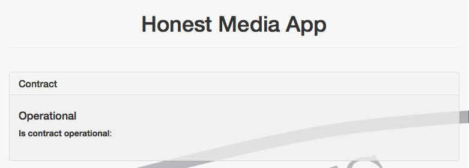
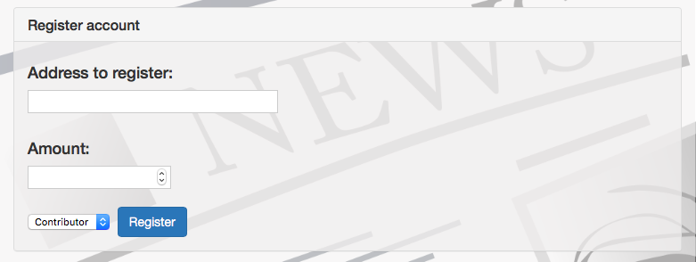
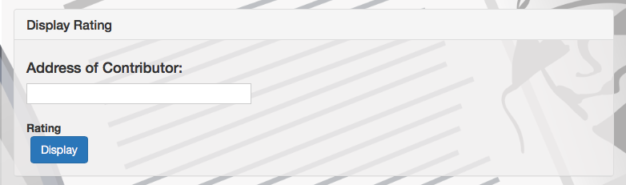
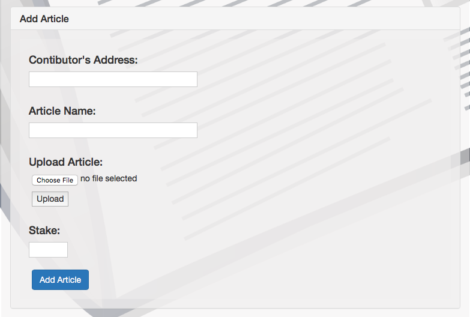
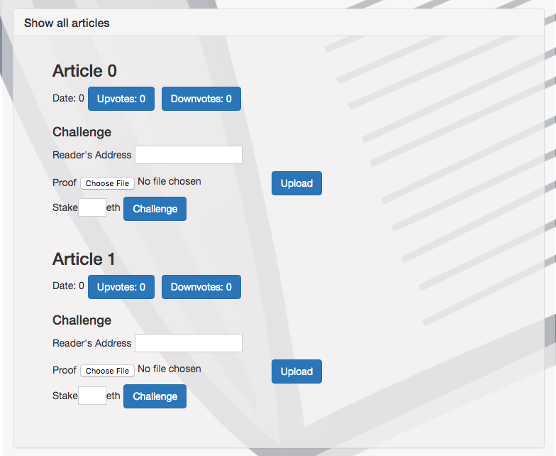
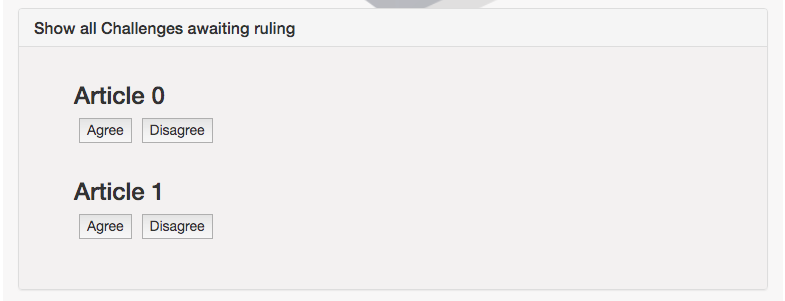

# Honest Media
## - Journalism on the blockchain

‘Fake News’ has been in the media lately and with so many options to get your news updates from, it becomes nearly impossible to judge what news is fake and what is real. With the rise in social media and blogging platforms, anyone, anywhere can publish ‘fake news’ and it doesn’t take long for it to spread. It becomes more difficult to distinguish good journalism from the fake. Journalists are incentivized for producing and reporting sensationalized content.

In recent years the media(news outlets, social network news feeds, etc.) have been instrumental in influencing governmental elections. Microsoft’s Digital Civility Index has rated Indian media as #1 in fake news. The fact that the largest democracy in the world has been constantly bombarded with fake news as they were getting ready to elect their new government is very troubling. It should be concerning to all nations who take pride in their democracy. Fake news in India has even resulted in mob lynchings and harassments where people have lost their lives. Deep fake videos are making the social media rounds. 

There is a great need for a trustworthy honest platform that people can trust. Moreover, it is very important for this platform to be de-centralized where the readers and content creators are responsible for keeping the content ‘honest’. Incentivizing people to do the right thing is important.

With the ‘Honest Media’ Dapp we address this issue. Anyone can register on this App. We make the content creators responsible for the content they publish. The reader can challenge the content if they think it is ‘fake’. The content will be stored in IPFS and will be immutable. This puts an added responsibility on journalists to publish only good, honest content.

## Why Blockchain?

Blockchain is used as a system that makes it easier for people to access data to ensure its efficiency and transparency. It creates immutable and transparency single point of proof of content origin, which helps to prevent a record from being falsified. 

Anyone from all around the world can be a writer. It allows everyone to equally join the network and creates equal rights to publish their content without any predefined set of rules, no matter of their race, gender, residence, etc.

It increases the public trust of journalism via user input which is required to challenge and validate the uploaded content. It brings democracy to journalism. It helps to achieve the trust among different parties, to maintain trust and build a reputation for producing high-quality news. 

## Research Links: 

* [Blockchain in Journalism](https://www.cjr.org/tow_center_reports/blockchain-in-journalism.php)
* [Blockchain Use Cases in Journalism](https://www.disruptordaily.com/blockchain-use-cases-journalism/)
* [Indian Media Fights Fake News](https://blog.wan-ifra.org/2019/02/01/indian-media-fights-fake-news-in-run-up-to-lok-sabha-elections)
* [Combating fake News in India](https://ssir.org/articles/entry/combating_fake_news_in_india)

# About the Dapp

There are three types of users on the app. 

## Validator:

A validator can perform 2 actions:

	1. Register: A validator can register after providing a minimum amount of funding.
	2. Rule on Challenges: When a reader challenges some content, three random validators are selected to rule on the challenge. The validator refers to the proof provided by the reader and decides if the challenge is successful or not. Two of the three positive votes are required for the challenge to be successful.

A validator needs to maintain a minimum balance (minimum funding amount).

## Contributor 

A Contributor  can perform 2 actions :

	1. Register: A contributor can register after providing a minimum amount of funding.
	2. Add Content: A contributor can upload the content that they want to publish and also the amount they are willing to stake on the content.

A contributor needs to maintain a minimum balance (minimum funding amount).

## Reader

A reader can perform 3 actions:

	1. Register: A reader can register. 
	2. Up Vote/ Down Vote Content: A reader can ‘up vote’ or ‘down vote’ any content that is published.
	3. Challenge: A reader can challenge any published content. They will upload proof and provide the amount they are willing to stake on the challenge. 

## The Challenge Process

	1. A reader can challenge any content that they think is fake. They will need to submit proof and the amount they are willing to stake on the challenge.
	2. Three random validators are selected to rule on the challenge.
	3. If 2 out of the 3 validators vote that the challenge is legitimate, the challenge is marked as successful.
	4. The amount staked by the contributor is equally divided between the reader who issued the challenge and the validators that voted.
	5. In case of an unsuccessful challenge, the amount staked by the reader who issued the challenge is equally divided among the contributor and the validators that voted.

__Functionality Issues__:
We had trouble retrieving the files uploaded to IPFS. Adding files to IPFS does not result in any errors, but trying to access the file on IPFS using the hash, results in a timeout. We were successful in adding and retrieving smaller sized text and image files.

# How to use the app

## Install

This repository contains Smart Contract code in Solidity (using Truffle) and dApp scaffolding (using HTML, CSS and JS).

To install:

	* download or clone the repo
	* run `npm install`
	* run `truffle compile`

## Develop Client

To use the dapp:

	* npm run dev

To view dapp:

	* http://localhost:3000

# Features

The app shows that contract is operational:

User can register as a Contributor, Validator or Reader:

Contributor can see one's rating:

A Contributor can add an article:

Everyone can see the list of articles:

Validators can rule on challenges that are awaiting ruling:

## Resources 

* [How does Ethereum work anyway?](https://medium.com/@preethikasireddy/how-does-ethereum-work-anyway-22d1df506369)
* [BIP39 Mnemonic Generator](https://iancoleman.io/bip39/)
* [Truffle Framework](http://truffleframework.com/)
* [Ganache Local Blockchain](http://truffleframework.com/ganache/)
* [Remix Solidity IDE](https://remix.ethereum.org/)
* [Solidity Language Reference](http://solidity.readthedocs.io/en/v0.4.24/)
* [Ethereum Blockchain Explorer](https://etherscan.io/)
* [Web3Js Reference](https://github.com/ethereum/wiki/wiki/JavaScript-API)
* [JS IPFS Reference](https://github.com/ipfs/js-ipfs)

## Future App Features:

	* Readers can reward contributors if they like the content.
	* Tokenize the contract.
	* Contributors can choose to reward previously stored/reported content if they use it.
	* Provide functionality for Contributors to ‘Certify/Copyright’ their content.

## Contact Developers:

	* Avanti: email: avanti.machado@gmail.com , github: https://github.com/ajmachado
	* Ringaile: email: ringaile@gmail.com , github: https://github.com/ringaile

