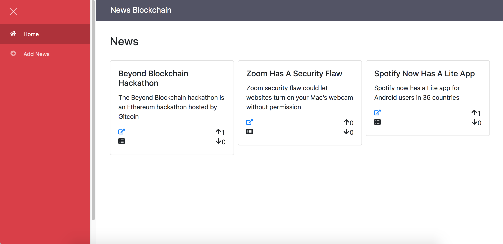
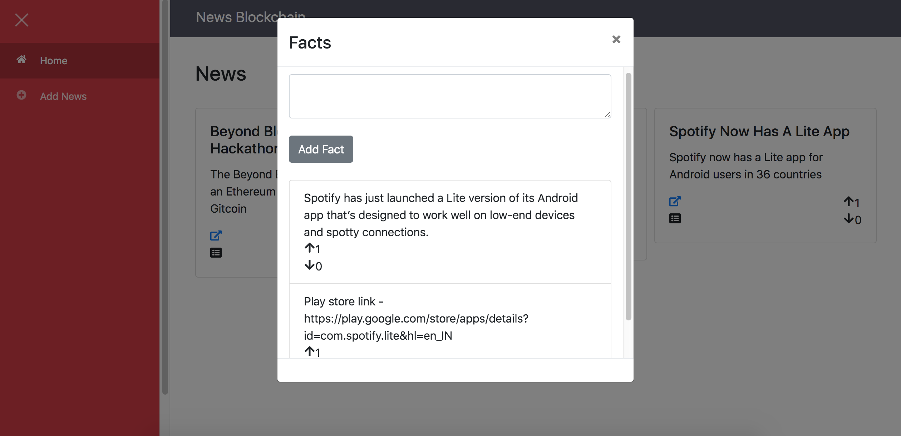
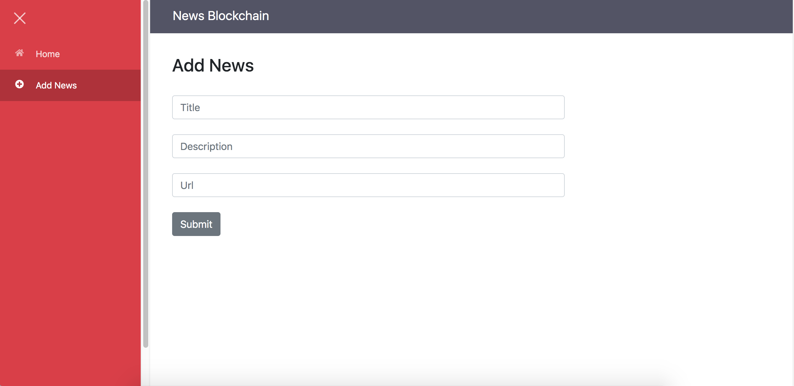

# News Blockchain

News blockchain incentivizes fact checking and quality. It helps to build a curative reputation. It allows credit to be given to original sources.

## Screenshots

### News List


### Facts for a News


### Add News


## Getting Started

1) Clone Repo

    ```
    git clone https://github.com/viraja1/news_blockchain.git
    ```
    
2) Change directory
    
   ```
   cd news_blockchain
   ```
   
3) Install truffle 
   
   Tested with Truffle v5.0.26 
   ```
   npm install truffle -g 
   ```
   
4) Install ganache-cli
   
   Tested with Ganache CLI v6.4.4 
   ```
   npm install ganache-cli -g 
   ```       

5) Install truffle-hdwallet-provider

   Tested with truffle-hdwallet-provider 1.0.13   
   ```
   npm install truffle-hdwallet-provider 
   ```
   
6) Launch local blockchain using ganache

   Note down the private key shown in the console once the 
   below command is run. Later you can import it using metamask 
   so that you have 100 ETH for the account in the local blockchain.
   ```
   ganache-cli -b 2 
   ```
   
7) Create .secret and .infurakey file

   .secret should contain the mnemonic for Rinkeby test network
   
   .infurakey should contain the api key for infura for 
   Rinkeby test network
   
   Leave these files empty incase you want to test it locally 
   using ganache  
   
8) Compile smart contract 
   ```
   truffle compile 
   ``` 
   
9) Migrate smart contract

   Note down the smart contract address shown in the console 
   once the below command is run. Select either development or 
   rinkeby network. 
   
   Development Network
   ```
   truffle migrate --network development 
   ```
   
   Rinkeby Network
   ```
   truffle migrate --network rinkeby 
   ```
   
10) Update smart contract address

    Update smart contract address in client/src/components/contract.js:6
    
    ```
    vi client/src/components/contract.js
    ``` 

11) Build client app

    ```
    cd client
    npm install
    ```
    
12) Start client app

    ```
    npm start
    ```
    
13) Open client app url in chrome

    ```
    http://localhost:8080
    ```
    
14) Install Metamask chrome extension

    ```
    https://chrome.google.com/webstore/detail/metamask/nkbihfbeogaeaoehlefnkodbefgpgknn?hl=en
    ```
    
15) Import / Create account in metamask

    If you are testing it locally, then you can import the account in metamask 
    by importing the private key that was shown in the console 
    when ganache-cli was started.
    
    For Rinkeby test network you can create a new account using metamask 
    and get some ether using faucet.
    ```
    https://faucet.rinkeby.io/

    ```
    
16) Test the App

    Make sure that you have selected the right network using 
    metamask (Localhost or Rinkeby). 
    
    Switch the networks in case ether balance is not relected for the account.                 